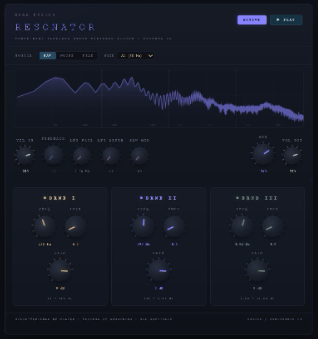

# PS3100 Resonator - VST3 Plugin
<br>
<p align="center">
  
</p>
<br>
<hr>

**A three-band parallel resonator VST3 plugin modeled after the Korg PS3100 resonator circuit, with design influences from the Polymoog resonator, Tiptop Audio Resonator, and Nonlinear Circuits Resonate. Features a unique per-band Dust Exciter for granular, physically-modeled resonant textures.**

<hr>

<br>

[](https://youtu.be/6IAOZ5ATTes)
<br>
↑ Click for Youtube Video Demo ↑


<br>
<hr>

## Install (Windows VST3)

1. Download the latest release `.zip` from the [Releases](../../releases) page
2. Extract the `.zip` file
3. Copy the `PS3100 Resonator.vst3` folder to:
   ```
   C:\Program Files\Common Files\VST3\
   ```
4. Open your DAW (Ableton, FL Studio, Bitwig, Reaper, etc.)
5. Rescan your VST3 plugin folder if needed
6. **PS3100 Resonator** will appear under **Depattern** in your plugin list

<hr>

## Circuit Heritage

The Korg PS3100 (1977) featured a resonator section with three parallel bandpass filter stages controlled via vactrols (VTL5C3/2 optocouplers). The OTA-based filter topology, driven by BC550c/BC560c transistor pairs, produced warm, vowel-like formant peaks that gave the PS3100 its distinctive vocal quality.

This plugin faithfully models that architecture in software:

- **Chamberlin state-variable filters** for accurate OTA bandpass behavior
- **Vactrol CV smoothing** with asymmetric attack/release (5ms / 50ms)
- **Transistor-pair soft clipping** at input and summing stages (BC550c/BC560c transfer characteristic)
- **Triangle LFO** for simultaneous frequency modulation of all three bands
- **Per-band Dust Exciter** for transient-reactive granular resonance (see below)

<hr>

## Dust Exciter

The Dust Exciter is a unique feature not found on the original PS3100 hardware. It was discovered by accident during development and deliberately engineered into a musical tool.

### How It Was Discovered

During prototyping, we noticed that rapidly adjusting the input volume knob produced a striking hollow, spectral, physically-modeled resonator sound; completely different from the normal resonator behavior. The effect only occurred *while the knob was being turned*, creating an ethereal ringing at the tuned band frequencies that sounded like striking a resonant metal surface.

### What's Actually Happening

The artifact occurs because abrupt gain changes create **step discontinuities** in the audio signal. When the volume knob jumps from one value to another, the entire audio signal is instantaneously multiplied by a different number. That sudden step is mathematically equivalent to a **wideband impulse**. It contains energy across the entire frequency spectrum simultaneously. When this impulse hits the three parallel bandpass filters, each filter rings at its tuned resonant frequency, producing the characteristic hollow, pitched decay.

This is the exact same principle behind **physical modeling synthesis**: a resonant body (the bandpass filters) is excited by an impulse (the gain discontinuity). The resonator's emphasis (Q) controls determine how long the ringing sustains, and the frequency knobs determine the pitches. It's acoustically identical to striking a tuning fork, a drum head, or a metallic surface.

### How It's Implemented

The Dust Exciter is a **sample-and-hold gain modulator** that deliberately creates these gain step discontinuities at a controllable rate:

1. A random gain value is sampled and held constant
2. The incoming audio is multiplied by this held gain before entering the bandpass filter
3. At irregular intervals, a new random gain value is sampled; the **transition** between the old and new value is the excitation impulse
4. The bandpass filter rings at its resonant frequency in response to each impulse

**The DUST knob controls the grain rate:**
- At **0%**: completely bypassed, no effect
- At **low values** (~5 Hz): slow, sparse pings; subtle hollow resonance on transients
- At **medium values** (~100–500 Hz): scattered, dusty texture; like sand on a vibrating plate
- At **high values** (~2000 Hz): dense granular cloud; the resonator becomes a shimmering, textured instrument

**Velocity sensitivity:** The gain variation depth tracks the input signal's envelope, so louder audio creates bigger gain jumps and stronger excitation. Quiet passages barely excite the resonator. Percussive transients create the strongest ringing. This makes the Dust Exciter inherently musical and dynamic.

**Per-band control:** Each of the three bands has its own independent DUST knob, allowing you to create complex textures; for example, heavy dust excitation in the high frequencies for shimmer while keeping the low band clean for weight.

<hr>

## Parameters

| Parameter | Range | Default | Description |
|-----------|-------|---------|-------------|
| **VOL IN** | -24 to +12 dB | 0 dB | Input level |
| **LFO RATE** | 0.01–12 Hz | 0.3 Hz | Frequency modulation speed (all bands) |
| **LFO DEPTH** | 0–100% | 0% | Frequency modulation amount |
| **MIX** | 0–100% | 70% | Wet/dry blend |
| **VOL OUT** | -24 to +12 dB | 0 dB | Output level |
| | | | |
| **Band I FREQ** | 60–600 Hz | 180 Hz | Low band center frequency |
| **Band I EMPH** | 0.5–40 | 4.0 | Low band resonance (Q) |
| **Band I GAIN** | -60 to +12 dB | 0 dB | Low band level |
| **Band I DUST** | 0–100% | 0% | Low band dust exciter amount |
| | | | |
| **Band II FREQ** | 200–3000 Hz | 800 Hz | Mid band center frequency |
| **Band II EMPH** | 0.5–40 | 4.0 | Mid band resonance (Q) |
| **Band II GAIN** | -60 to +12 dB | 0 dB | Mid band level |
| **Band II DUST** | 0–100% | 0% | Mid band dust exciter amount |
| | | | |
| **Band III FREQ** | 1k–12k Hz | 4000 Hz | High band center frequency |
| **Band III EMPH** | 0.5–40 | 4.0 | High band resonance (Q) |
| **Band III GAIN** | -60 to +12 dB | 0 dB | High band level |
| **Band III DUST** | 0–100% | 0% | High band dust exciter amount |

<hr>

## Signal Flow

```
                            ┌─────────────────────────────────────────┐
                            │          PER BAND (×3 parallel)         │
                            │                                         │
Input ──► [VOL IN] ──► [Soft Clip] ──►│  [Dust Exciter] ──► [SVF Bandpass] ──► [Band Gain]  │──► [Sum]
                            │   (S&H gain mod)    (Vactrol CV)               │
                            └─────────────────────────────────────────┘
                                                                              │
                                                                              ▼
                                                              [Soft Clip] ──► [DC Block]
                                                                              │
                                                              [Wet/Dry Mix] ◄─┘
                                                                  │
                                                            [VOL OUT] ──► Output

             [Triangle LFO] ──────────► modulates all band frequencies
```

<hr>

## Building From Source

See [BUILD.md](BUILD.md) for complete build instructions.

**Requirements:**
- Visual Studio 2026 (or 2022+) with "Desktop development with C++" workload
- CMake 3.22+
- JUCE framework (cloned automatically)

**Quick build:**
```cmd
git clone https://github.com/juce-framework/JUCE.git
mkdir build && cd build
cmake .. -G "Visual Studio 18 2026" -A x64
cmake --build . --config Release
```

The built `.vst3` will be in `build\PS3100Resonator_artefacts\Release\VST3\` and is also auto-copied to your system VST3 folder.

<hr>

## License

DSP code is provided as-is for personal/educational use.
JUCE has its own licensing terms — see https://juce.com/legal/

<hr>

*Inspired by the Korg PS3100, Polymoog, Tiptop Audio Resonator, Nonlinear Circuits Resonate, and DSPTone Polyresonator. All product names and trademarks are the property of their respective owners.*
